## Thinking like a Phisher
#### To prevent phishing

---
## What is phishing?
 - Phishing is 
    ``the fraudulent practice of sending emails or other messages purporting to be from reputable companies in order to induce individuals to reveal personal information, such as passwords and credit card numbers``.
    Typically targetting a large number of users with a very generic but enticing message such as "you're a winner!" or "special discount".

 - Spear Phishing and Whaling is targeted phishing, aiming quality over quantity. 

---
## Goal of phishing
Phishing provides a way for attackers to obtain information such as:

 * Funds by convincing someone to wire transfer or send gift cards

 * Confidential data like personal information or documents that can be sold on the dark web

 * Credit card information that can be used to purchase goods that can then be resold

 * Deploy ransomware and hold data for ransom

 * Get access to internal resources that can be used to pivot to other people or systems

---

### Example of directly getting CC info

A sample phishing email for credit card info as demonstrated by the generic "Costco Shopper".
Notice that the domain used is not costco.com.

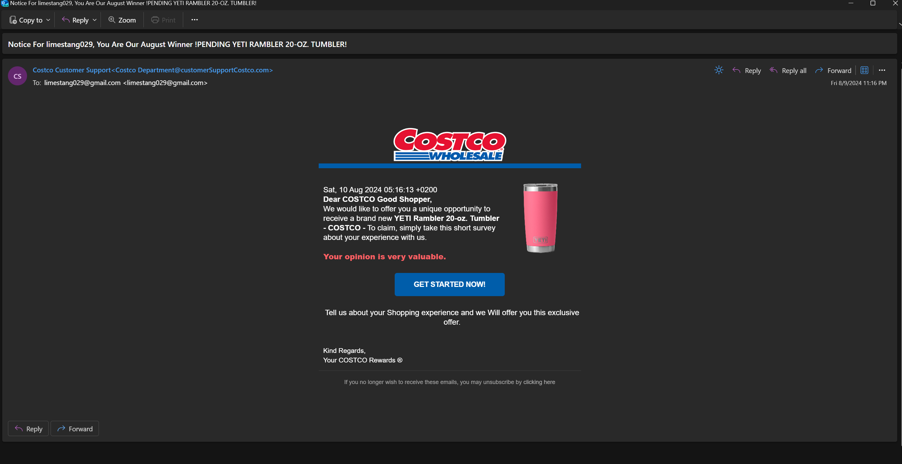

Note: Vertical slides for the rest of the home photos
----

### Example of directly getting CC info
Clicking on the link brings us to this page where we would enter in our personal information under the guise of needing shipping information. They add information to show the site is secure by mentioning brands such as McAfee, Norton and certificate trust networks.
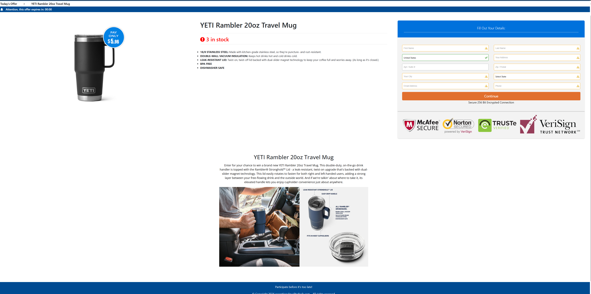

----

### Example of directly getting CC info
The final form asks for my credit card information to "pay for shipping", with that information - I am doubtful I'd ever see my mug, but I might see other charges on the card before I am able to cancel it.

If they purchase goods they can then sell them on the web even after the transaction is reversed.
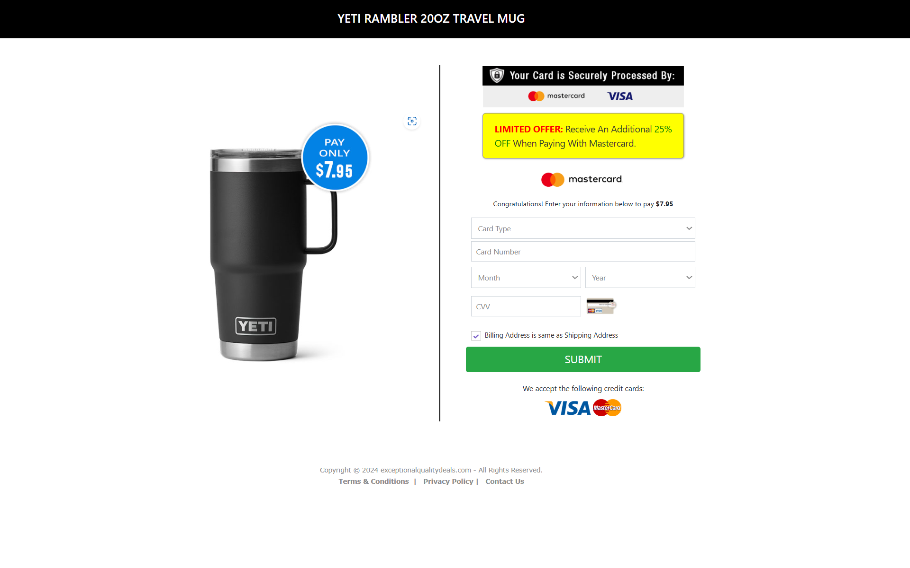

---

### Example of a getting credentials
The below invites us to review an encrypted message. A spear phishing version of this may say it is from a vendor, my coworker, partner organization or supervisor to entince us to open the document and sign in.
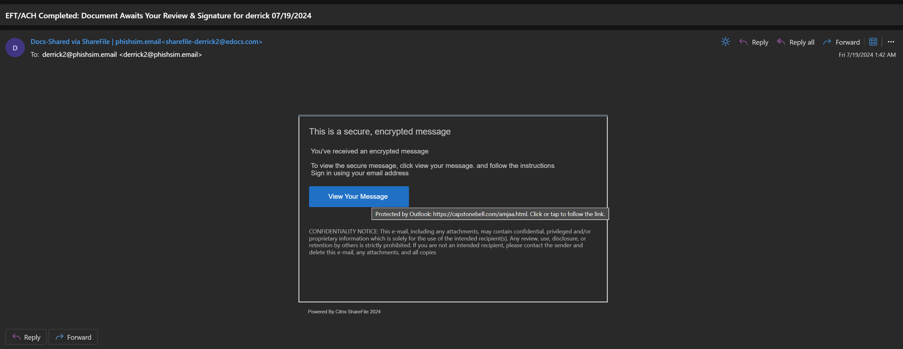

----

### Example of a getting credentials
Opening the phishing email could send us to a webpage that looks like the below. It does a few things to make it seem legitimate:
 * The login page looks similar to the real one
 * The URL address has sharefile in it to make it seem legitimate. 
 * The padlock is there for HTTPS encryption - but in this case it actually means your data is securely encrypted right to the phisher!

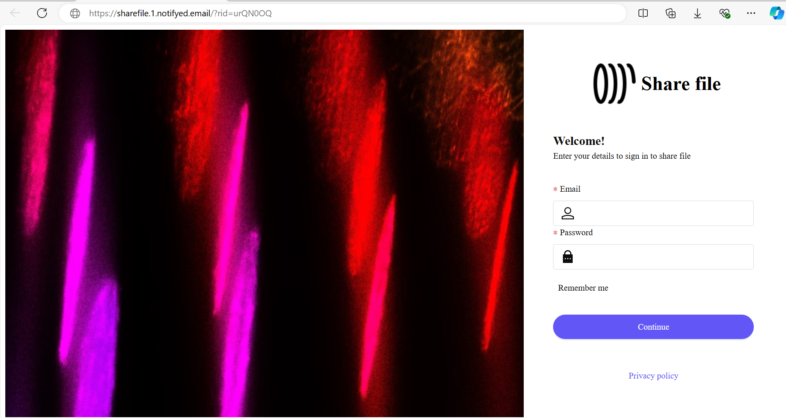

----

### Example of a getting credentials
After you enter your details and "sign in"
 * The entered email address, password, and information on your browser like OS and version will be shared with the phisher when you submit it
 * Usually the application can send you to the real site as if you entered the password incorrectly, you may not even notice.

---

#### Protecting against phishing

 * Play it safe - if you arn't sure the link is legitimate browse to the website you know and trust first such as Microsoft.com or Adobe.com

 * Report the email as phishing using the button in Outlook
   * This will notify IT to review who it was sent to and can be used by our email provider to better fine tune their filtering

* If you arn't sure if an email is phishing - check with the sender before accessing anything in the email
  * Hi Duncan, I got an email for reviewing a file - I wanted to check this was legitimate.

 * If you entered in your password - reset it immediately and contact IT support.
   * IT support can also clear out anywhere that "Remember me" was checked to sign the attackers out if they had used the old password to sign in before it changed
   * They can also add additional monitoring protections for your account that normally might cause too many alerts.
----
#### Protecting against phishing

 * Multifactor Authentication
   * Tools such as Duo, Authenticator, WebAuth and drive tokens can provide a second layer of protection even if your password is compromised
   * SMS and Phone authentication are considered better than just password authentication, but vastly worse than token, webauth or software based Multifactor
   * All multifactor isn't fail proof - if the code or session is shared with the phisher they will still be signed in until all sessions are signed out.

* Password Managers
   * These are usually setup to only enter the password on a domain it's been entered on before. 
     * So it won't enter in your adobe.com credentials on adobe.suspiciousphishing.com.
---

## Demo - A Phishing simulation tool

----
### GoPhish
 GoPhish is a free tool recommended by CISA that is designed for testing phishing training by internal IT departments. 
 
 We're going to use it to demonstrate how easy it can be to send a phishing email to a large group of people, identify who has clicked on the email and even see any information entered on the page!

Open https://URL_HERE then sign in with username admin and password PASSWORDHERE
 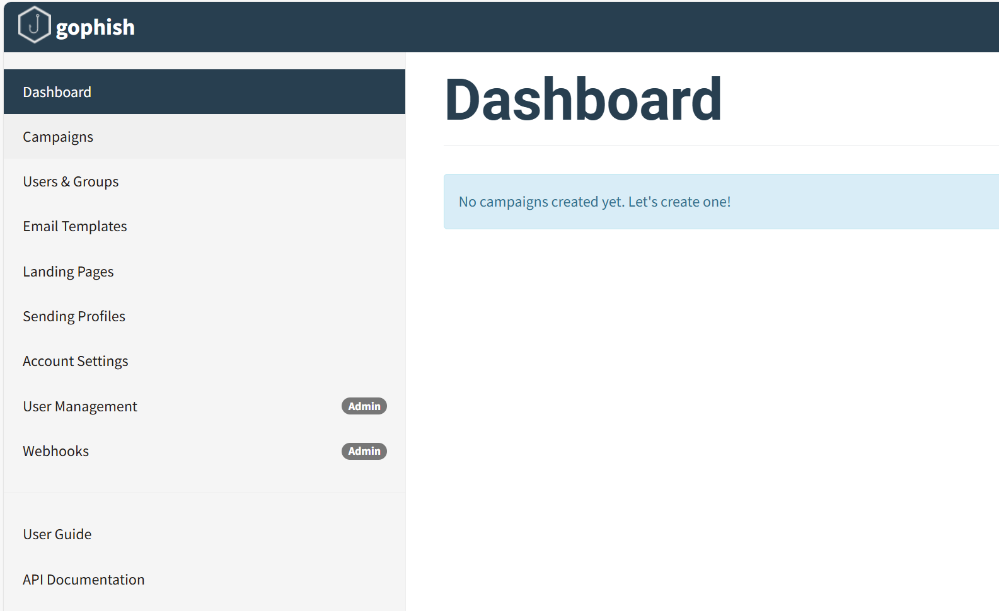

----
#### Overview
There are a few sections - 
 * Campaigns - This is where we will send the emails to groups of users
 * Users and Groups - We can add a list of users such as from a website database leak, looking at a website, or even just guessing something like first name + last name@website.com
 * Email templates - These are the mail merge templates where we enter in the content of the email sent to each person in the users and groups
 * Landing Pages - These will be the fake sign in pages in our case, they'll be setup to look like some real sign in pages.
 * All the rest of the settings we are not interested in for this demo

----
#### Users and Groups
 * This will open a list of groups, these can be imported from Excel/CSV.
   * These lists could come from online staff directories, previous database dumps and hacks from trusted websites or companies, or any other number of sources.
 * If you click the green pencil it will open up the list and you can see some users, their email and their position.
   * Some other platforms can allow for adding organization information like managers to allow sending emails to someone from their "Manager".
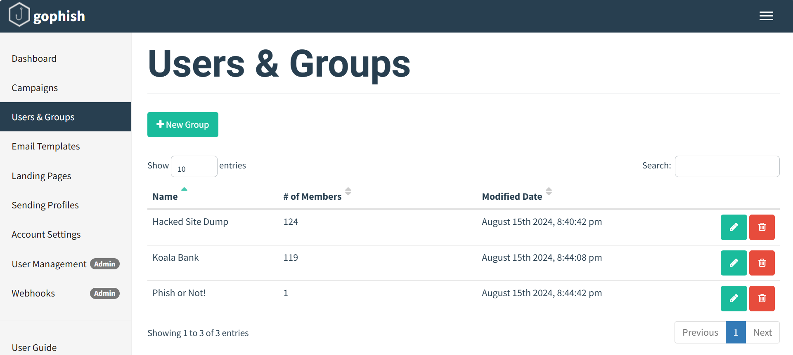 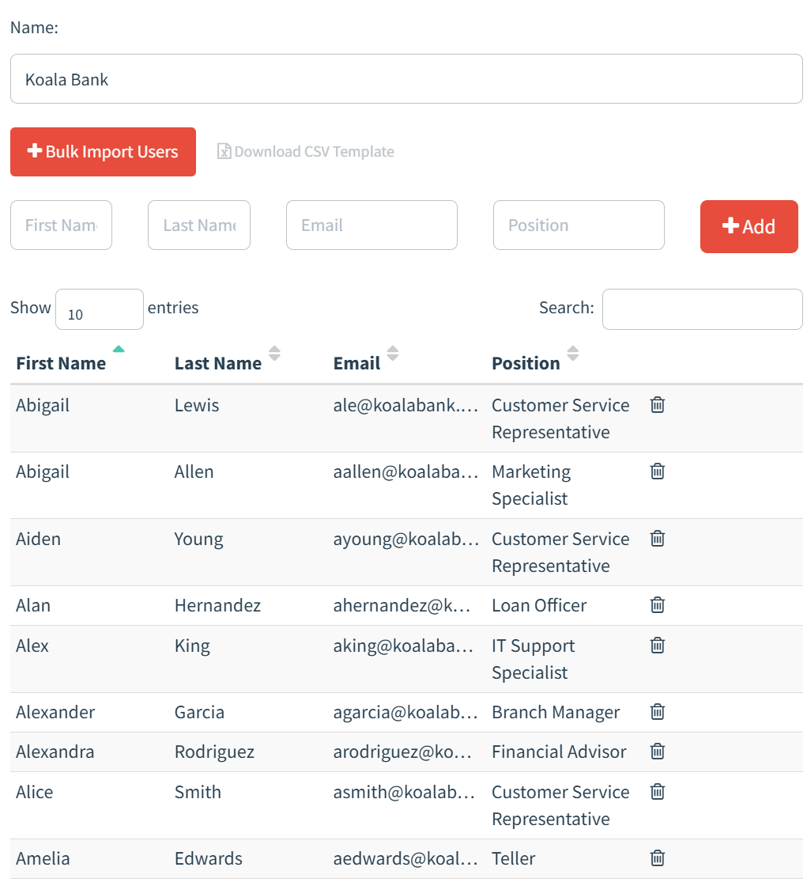

----
#### Email Templates
 * These are different emails designed to entice a user into clicking on the link and entering their information
   * These can use things like security concerns or urgency to trick you into not noticing it is a phish.
   * For example saying your account will be shut off in 24 hours if you don't confirm your login or your package will be returned if you don't sign in to update the address
 * They offer a mail merge link functionality where {{.First}} would be replaced with the persons first name from Users and Groups when the email is actually sent
 * Notice at the top we can edit who it says the email is from - we could enter in anything - even something like `"IT Support <ITSupport@pandabanke.com>"`
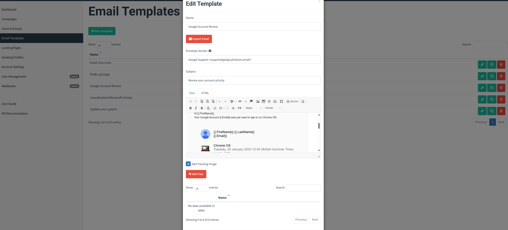

----
#### Landing Pages
 * These are the pages a person is sent to when they click on the link in the email.

 * These will be setup with a username/email field at the very least, maybe a password field

 * Anything entered here will be stored on the server and viewable by us if the boxes are checked at the bottom

 * At the very bottom we can select a URL to send the person to after we have collected their password such as the real login page or a training video for internal IT

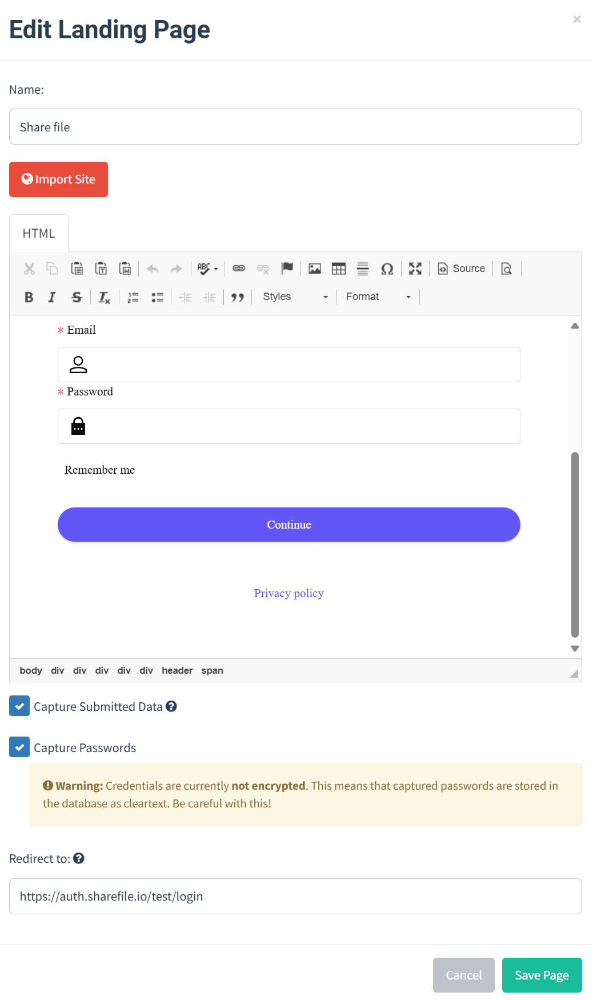

----
#### Campaign
 * Here we will create the combination of the email template and landing page to send to a group of users.
 * Lets send campaign to the group of pandabank users.
   * Select the email template and a landing page
   * Leave the dates alone for this. The dates can be confgured to spread emails out as 100 emails from "IT Support" at the same time would likely alert our email system that something is unusual.
   * Enter in a URL like "https://usersupport.REPLACEDOMAINHERE" 
   * Select the group at the bottom to send the emails to

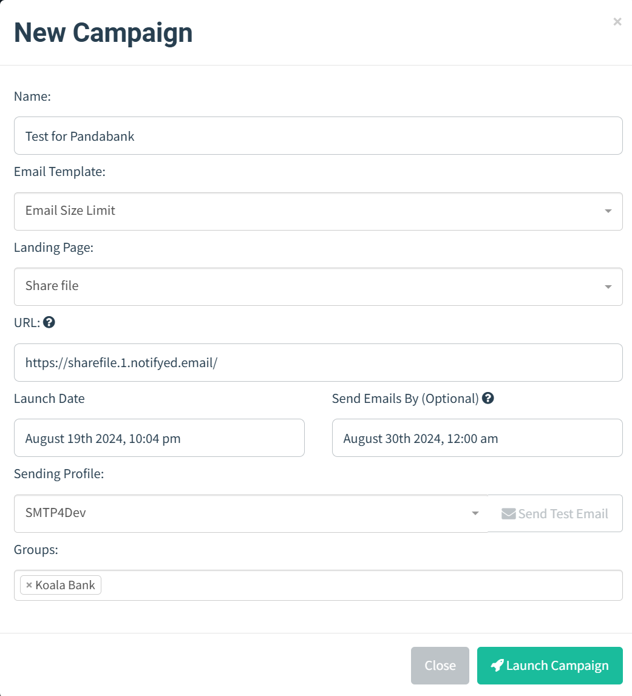

----
#### Preview the campaign
 * Open https://email.DOMAINHERE in a new tab and sign in with USERNAME and PASSWORD to view all the fake emails we sent out
 * On the left you can see all the emails we sent with Gophish, click on one to open it
 * It will preview the email on the right

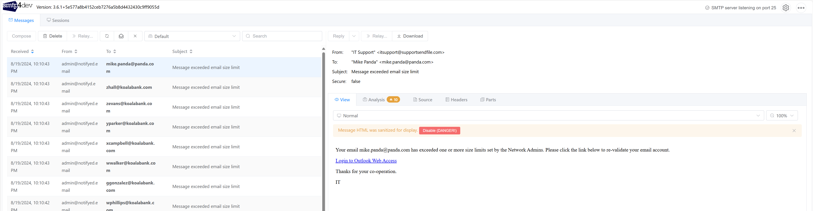

----
#### Preview the landing page
 * Click on the link in the email, it will open the landing page
 * Enter in a fake email/username and password then hit submit.

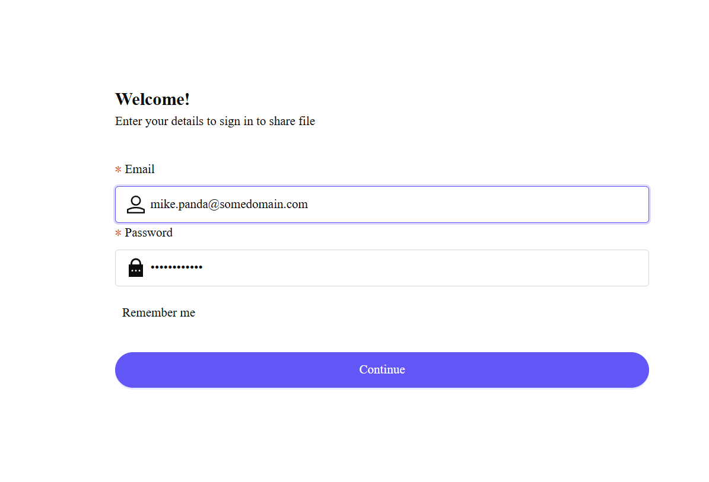

----
#### Campaign Results
 * Go back to the GoPhish campaign page
 * Click the graph to view the campaign results as our "users" click on them.
 * It will show details like how many opened the link and how many entered in details like their email or password on the landing page.

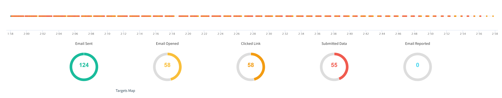

----
#### Campaign Details
 * Scrolling down you can view the results per individuals, if you search `submitted` or the email you entered above you can view details on someone who submitted including the computer information, their email and password

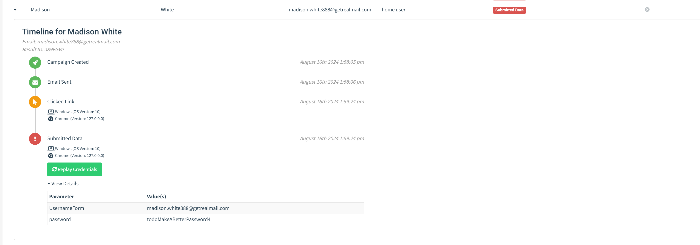

---
### Further Phishing Concerns

 * Smishing/Vishing
   * Similar to phishing, but using text messages or phone calls.
 * OAuth / Sign in with X phishing
   * Sign in with your Google/Microsoft/other accounts can allow applications to access your data or even act on your behalf even after you've already closed the browser.
   * Enterprise sign in can be setup to require IT review and approval before you are allowed to access that application.
   * Sign in with application titles can be modified easily, an attacker can tell a website to say it is "Microsoft Word" even when it isn't

---
## Summary
 * Phishing can sometimes be hard to detect, if in doubt - sign directly into the website using your know address like Adobe.com, Microsoft.com and check with the perported sender of the email via a trusted channel like a phone call.

 * If you enter in your credentials to a phishing site reset your password and reach out to IT

 * Tools like Multifactor Authentication and password managers can assist with basic forms of phishing.

---
#### Appendix - Checking if your password or email has been leaked in a breach
 * The below will not tell you if you have been phished, only if a company/website was compromised and your sign in was extracted

 * Password managers often have the ability to check your password from previous breached
 * A stand alone tool like https://haveibeenpwned.com/ also allows for you to search your email address for breaches
 * If you see your email was in a breach, please make sure you've changed your password since the date listed as hackers will likely be trying the leaked passwords on common websites

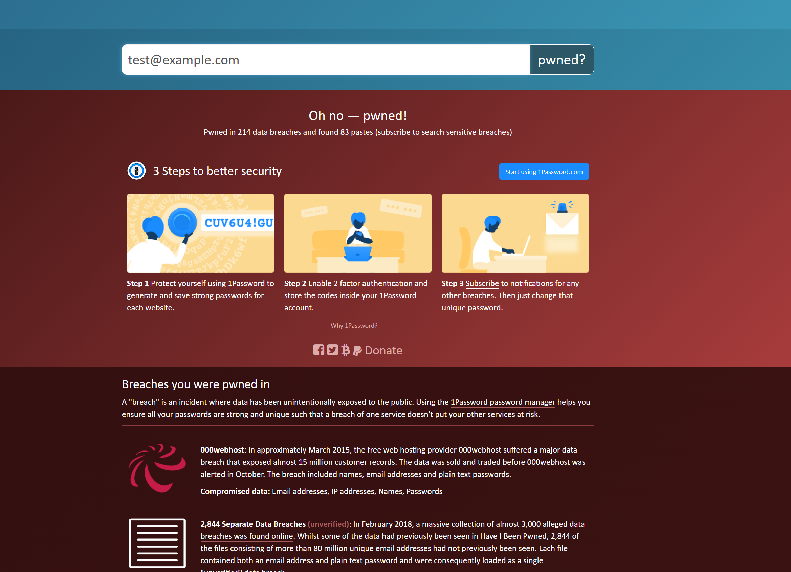
